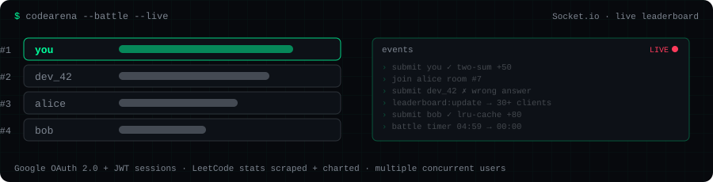
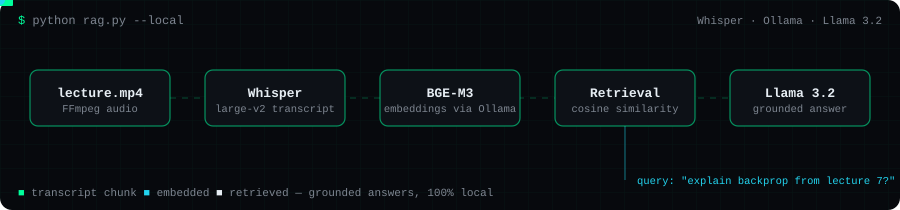

<div align="center">

 things that slide."/>

<a href="https://krishbrahmbhatt.vercel.app"></a>
<a href="https://linkedin.com/in/krishbrahmbhatt23"></a>
<a href="https://leetcode.com/u/Krish_2326/"></a>
<a href="mailto:krish.dev.404@gmail.com"></a>

</div>

<br>

## About

I am a Computer Engineering student who likes building complete web apps, from the frontend to the backend. I also enjoy the harder parts, like adding AI features, working with networks, and writing multithreaded code.

- **Full stack and backend.** I build React and Next.js frontends with Node.js and Express APIs behind them. I use JWT for login, MongoDB for data, and Socket.io when something needs to update live. I have done this for freelance clients and for my own projects.
- **AI and ML inside real apps.** I have connected Google Gemini to an app and checked its output with a Zod schema, so bad responses never reach the user. I have also built a RAG pipeline that runs fully on my own machine using Whisper, BGE-M3 embeddings and Llama 3.2 through Ollama. For data work I use Pandas, NumPy and Scikit-learn.
- **Systems and debugging.** I wrote a multithreaded Deep Packet Inspection engine in C++. During my internship I fixed rate limit failures and designed a logging system that made it easier to find the root cause of problems across 30+ exchange integrations.

I have strong OOP basics in **Java** and **Python**, and I solve LeetCode problems in **C++**.

<br>

## Experience

### Software Developer Intern, Xorvest
<sub>May 2026 to July 2026, Remote</sub>

- Built one REST API layer in Python that works with **30+ cryptocurrency exchanges**. Used a **layered service architecture** so the business logic stays separate from the exchange integrations.
- Exchanges were rejecting too many requests. I fixed this by adding a rate limiter based on the **Token Bucket algorithm**, which slows requests down before they turn into errors.
- Designed a **logging system with four levels** (DEBUG, INFO, WARNING, ERROR) so a request can be traced from start to end and problems can be found faster.

### Full Stack Developer, Freelance
<sub>December 2025 to Present, Remote</sub>

- Build and deploy full stack JavaScript apps for clients using **React.js, Next.js, Node.js, Express.js, MongoDB and Tailwind CSS**.
- Design and use **REST APIs**, add **JWT login**, write reusable React components and manage app state.
- Write backend services in Node.js and Express.js, connect third-party APIs, add real-time features with **Socket.io**, and deploy using Git.

<br>

## Projects

<sub>Each diagram below is an animated SVG that shows how the project works.</sub>

### Deep Packet Inspection System



A C++ program that looks at live network traffic, finds the website name (**TLS SNI**) inside the TLS Client Hello, and applies rules to each connection in real time.

- **Multithreaded pipeline** with four stages: Reader, Load Balancer, Fast Path and Writer. **Consistent hashing** makes sure all packets from one connection go to the same worker thread.
- A **thread-safe queue** built with mutexes and condition variables passes work between producer and consumer threads.
- Rules can **block by IP, app or domain**, and the program reports traffic in real time.

`C++` `Multithreading` `Network Programming` `TLS` &nbsp;|&nbsp; [**Source**](https://github.com/Brahmbhatt-Krish/Deep-Packet-Inspection-System)

<br>

### HireSense



A recruitment web app that reads resumes and creates interview reports using AI. The main challenge was making the AI output reliable, not just calling the API.

- **Gemini API** responses are checked against a **Zod schema**, so the app only accepts well-formed data.
- Backend is an **Express.js REST API** with **bcrypt** password hashing and **JWT** login.
- Responsive **React.js** frontend. Reports can be exported to **PDF using Puppeteer**.

`React.js` `Node.js` `Express.js` `MongoDB` `Google Gemini` `Zod` `JWT` &nbsp;|&nbsp; [**Live**](https://hire-sense-swart.vercel.app/login) &nbsp;|&nbsp; [**Source**](https://github.com/Brahmbhatt-Krish/HireSense)

<br>

### CodeArena



A LeetCode progress tracker where users can also compete against each other in **live coding battles**.

- Battles run in real time over **Socket.io**, with a leaderboard that updates live for **30+ users**.
- Sign in with **Google OAuth 2.0**, sessions handled with **JWT**.
- LeetCode stats are **scraped automatically** and shown as **Chart.js** donut charts by difficulty.

`React.js` `Node.js` `Socket.io` `MongoDB Atlas` `OAuth 2.0` `Chart.js` &nbsp;|&nbsp; [**Live**](https://krish2323-codearena.hf.space/) &nbsp;|&nbsp; [**Source**](https://github.com/Brahmbhatt-Krish/CodeArena)

<br>

### RAG AI Teaching Assistant



Ask a question about a lecture video and get an answer based on what was actually said in it. Everything runs on my own machine, no paid API needed.

- **Four steps:** FFmpeg and **Whisper large-v2** turn the video into a transcript, **Ollama with BGE-M3** turns the text into embeddings, **cosine similarity** finds the matching parts, and **Llama 3.2** writes the answer.
- Because the answer is built from real transcript pieces, the model makes things up far less.
- Runs fully on local models.

`Python` `OpenAI Whisper` `Ollama` `Llama 3.2` `Scikit-learn` &nbsp;|&nbsp; [**Source**](https://github.com/Brahmbhatt-Krish/RAG-based-AI-Teaching_Assistant)

<br>

## Tech Stack

<table>
<tr>
<td align="right"><b>Languages</b></td>
<td><br><sub>Java, Python, JavaScript, C++</sub></td>
</tr>
<tr>
<td align="right"><b>Frontend</b></td>
<td><br><sub>React.js, Next.js, Vite, Tailwind CSS, HTML5, CSS3</sub></td>
</tr>
<tr>
<td align="right"><b>Backend</b></td>
<td><br><sub>Node.js, Express.js, REST APIs, Layered Service Architecture, JWT Authentication, Socket.io</sub></td>
</tr>
<tr>
<td align="right"><b>AI / ML</b></td>
<td>   <br><sub>LLM Integration (Google Gemini, Llama 3.2), RAG, Ollama, OpenAI Whisper, Pandas, NumPy, Scikit-learn</sub></td>
</tr>
<tr>
<td align="right"><b>Databases</b></td>
<td><br><sub>MongoDB, MongoDB Atlas, Firebase, SQLite</sub></td>
</tr>
<tr>
<td align="right"><b>Cloud / Infra</b></td>
<td><br><sub>AWS (EC2, S3, IAM, Lambda), Docker</sub></td>
</tr>
<tr>
<td align="right"><b>Tools</b></td>
<td><br><sub>Git, GitHub, Postman</sub></td>
</tr>
</table>

<br>

## Things I Have Worked On

| Topic | Where |
|:--|:--|
| **REST API design and layered architecture** | Xorvest (30+ exchange integrations), HireSense, freelance work |
| **Login and authentication** (JWT, bcrypt, Google OAuth 2.0) | HireSense, CodeArena, freelance work |
| **Rate limiting** (Token Bucket) | Xorvest |
| **Logging and tracing** (four log levels, root cause debugging) | Xorvest |
| **Real-time updates** (Socket.io) | CodeArena, freelance work |
| **Multithreading** (producer and consumer threads, mutexes, condition variables) | Deep Packet Inspection System |
| **Network programming** (reading the TLS Client Hello, per-connection state, consistent hashing) | Deep Packet Inspection System |
| **Using an LLM safely** (structured and validated output) | HireSense |
| **RAG pipelines and local models** | RAG AI Teaching Assistant |
| **Cloud basics** (EC2, S3, IAM, RDS, Lambda) | AWS Academy Cloud Foundations labs |

<br>

## Education and Achievements

<table>
<tr>
<td width="50%" valign="top">

<h3>Education</h3>

<b>Bachelor of Engineering, Computer Engineering</b><br>
Sardar Vallabhbhai Patel Institute of Technology<br>
<sub>Expected May 2027, CGPA 8.65 / 10</sub>

</td>
<td width="50%" valign="top">

<h3>Achievements and Certifications</h3>

<ul>
<li><b>Top 1% in Gujarat</b>, HSC Board Examination (2023)</li>
<li><b>170+ LeetCode problems</b> solved in C++</li>
<li><b>AWS Academy Cloud Foundations</b>: 20+ labs on EC2, S3, IAM, RDS and Lambda</li>
<li><b>The Ultimate Data Science Course</b> (Code With Harry): 25+ exercises in NumPy, Pandas and Matplotlib</li>
</ul>

</td>
</tr>
</table>

<br>

## Activity

<div align="center">


<br><br>


</div>

<br>

<div align="center">

```bash
$ connect --no-spam
```

<a href="https://linkedin.com/in/krishbrahmbhatt23"></a>
<a href="https://github.com/Brahmbhatt-Krish"></a>
<a href="https://leetcode.com/u/Krish_2326/"></a>
<a href="https://krishbrahmbhatt.vercel.app"></a>
<a href="mailto:krish.dev.404@gmail.com"></a>

<br><br>

```bash
$ echo "from packets to pixels."
```

</div>
